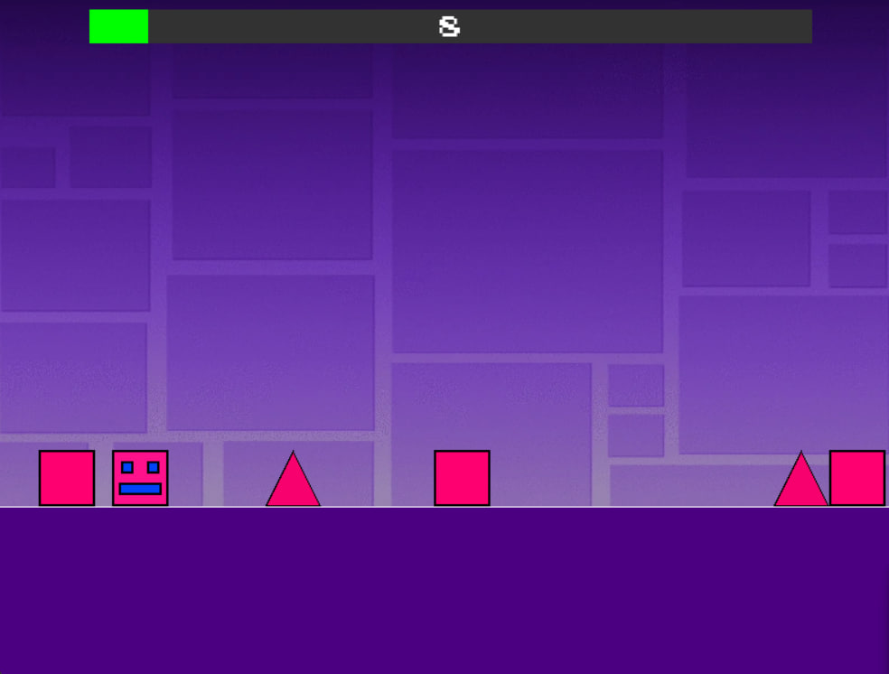
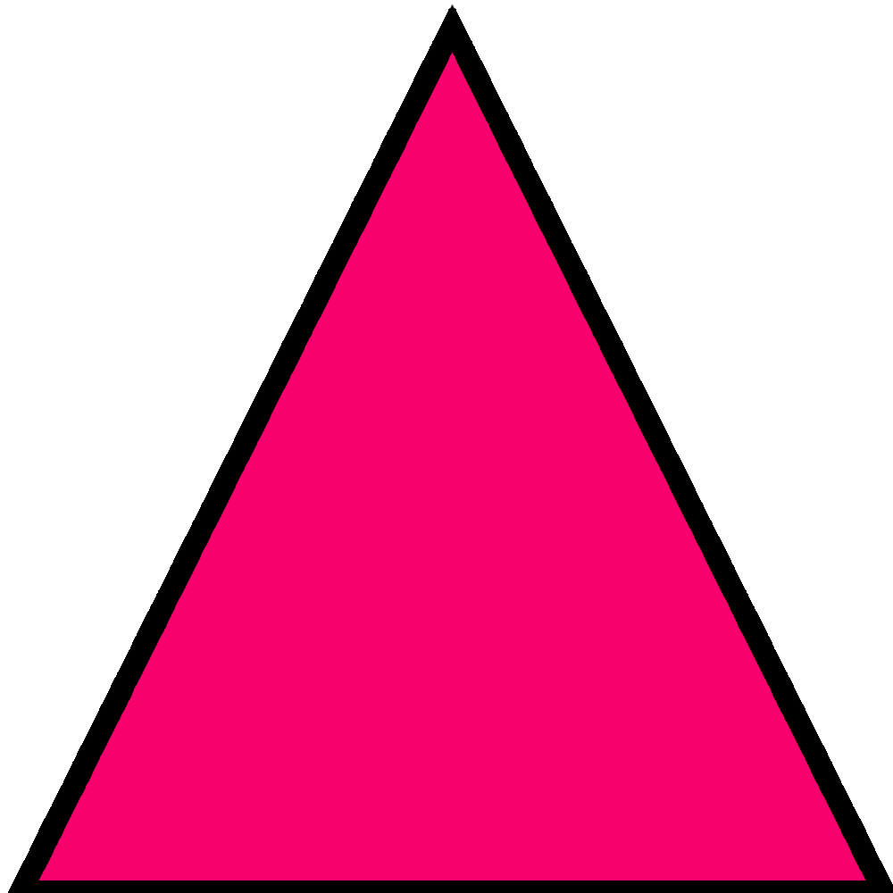
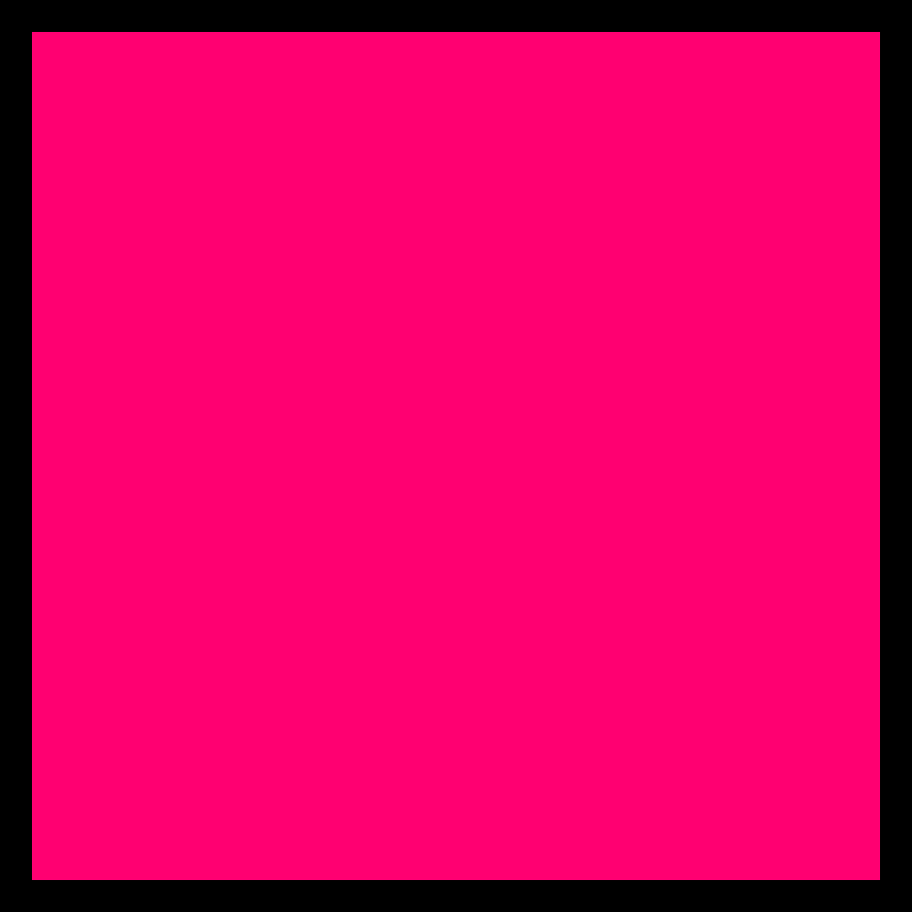
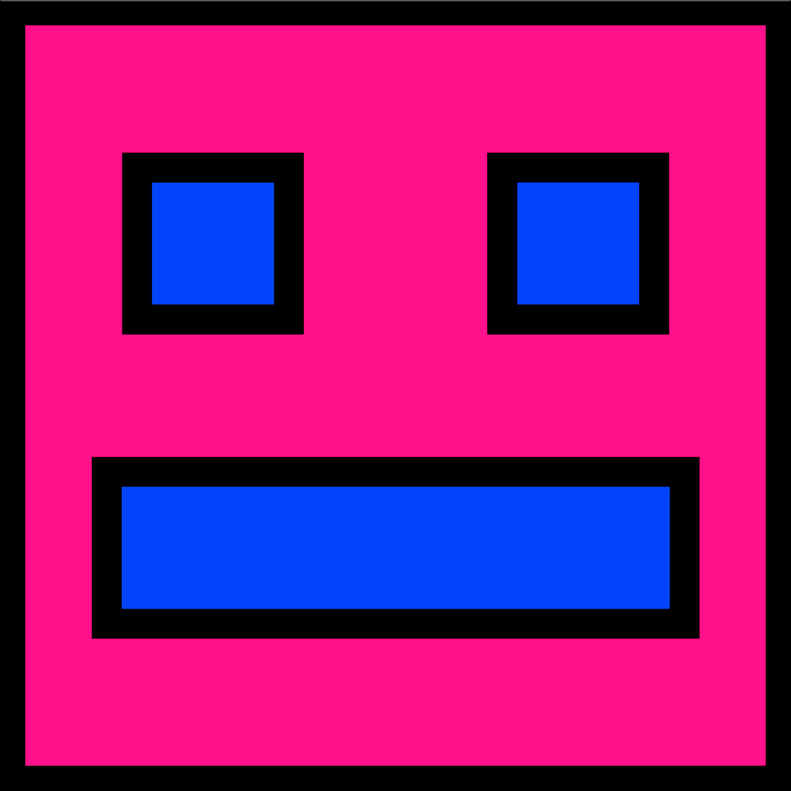
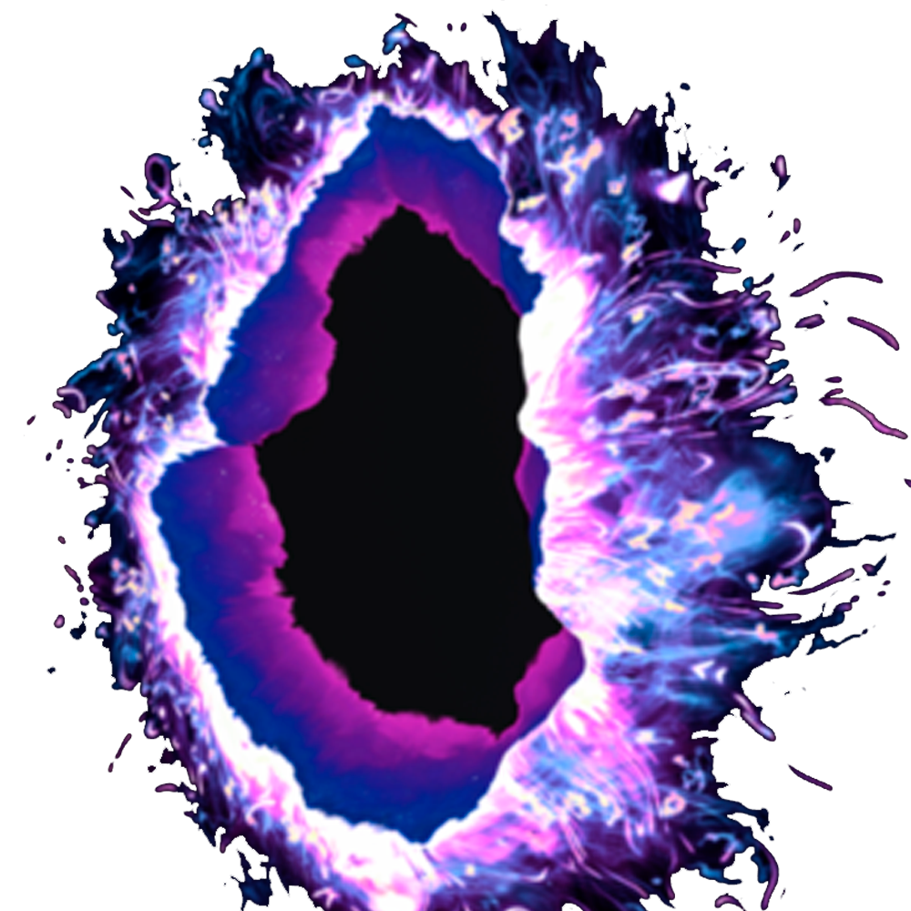

# **Geometry Dash - Game Design Document - SK**

**Autor**: Ivan Alisov 

**Vybraná téma**: One level, but constantly changing

---
## **1. Úvod**
Hra je vytvorená pre projekt OT. Vyrobená na pygame. Hra zodpovedá téme "Jedna úroveň, ale neustále sa mení". Hra je podobná hre Geometry Dash. Spĺňa požiadavky témy. Je tu jeden úroveň, ktory sa mení a mení sa aj obtiažnosť. Cieľom je dosiahnuť konečný bod.

  
   
  <em>Obrázok 1 Ukážka hry Geometry Dash</em>

### **1.1 - Popis hry**
Geometry Dash je dynamická plošinovka, v ktorej hráč ovláda kocku a za sprievodu rytmickej hudby prechádza úrovňami s prekážkami. Hráč musí skákať, vyhýbať sa nástrahám, prekonávať plošiny a prechádzať portálmi, ktoré menia hrateľnosť. Hra je známa svojou náročnosťou, minimalistickým dizajnom, jasnými vizuálnymi efektmi a synchronizáciou hrania so zvukovou stopou.
### **1.2 Vývojový softvér**
- **Pygame-CE**: zvolený programovací jazyk.
- **PyCharm 2024.1**: vybrané IDE.

---
## **2. Koncept**
### **2.1 Základné mechaniky**
- **Pohyb:** Objekty mapy sa posúvajú doľava, aby sa vytvoril efekt pohybu hráča doprava.
- **Skok:** Hráč skáče, uplatňuje sa gravitácia, môže skákať na niektoré objekty mapy.
- **Kolízie:** Hráč sa stretáva s objektmi mapy. Takto sa spracúva herná logika.

### **2.2 Návrh tried**
- **Game:** Táto trieda je hlavnou triedou, ktorá sa stará o hranie. Zvuky, pozadia, herná logika atď.
- **Player:** Trieda vytvára hráča. A spracováva jeho funkcie (skok, gravitácia).
- **Level:** Trieda spracuje úroveň z textového dokumentu a vykreslí ju na obrazovku. A spracúva progress bar.
  

---
## **3. Grafika**
### **3.1 Dizajn**
Obrázky pre hru boli prevzaté z otvorených zdrojov, dodatočne upravené vo Photoshope. 

  <table>
    <tr>
      <td align="center">
        
         
        <em>Triangle</em>
      </td>
      <td align="center">
        
         
        <em>Cube</em>
      </td>
      <td align="center">
        
         
        <em>Player</em>
      </td>
      <td align="center">
        
         
        <em>Portal</em>
      </td>
    </tr>
  </table>

---
## **4. Ovládanie**
### **4.1 Klávesnica**
Hráč počas hry skáče stlačením medzerníka na klávesnici.

### **4.2 Myš**
Ovládanie v rozhraní po víťazstve sa vykoná kliknutím na ľavé tlačidlo myši. Pomocou tohto tlačidla môžete tiež vykonať skok.

---
## **5. Zvuk**
### **5.1 Hudba**
Pre hudbu na pozadí úrovne bol použitý pôvodný soundtrack z hry(https://youtu.be/tof8_p0F3kg?si=F4slaByALfdCIUlj).

### 5.2 Zvuky
Zvuk ukončenia hry a zvuk kolízie a prehrávania boli prevzaté z voľne dostupných stránok so zvukmi pre vývoj hier

---

